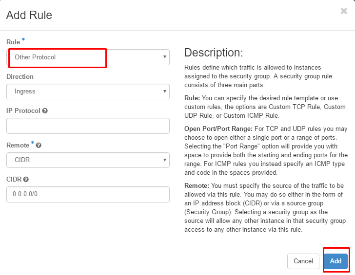
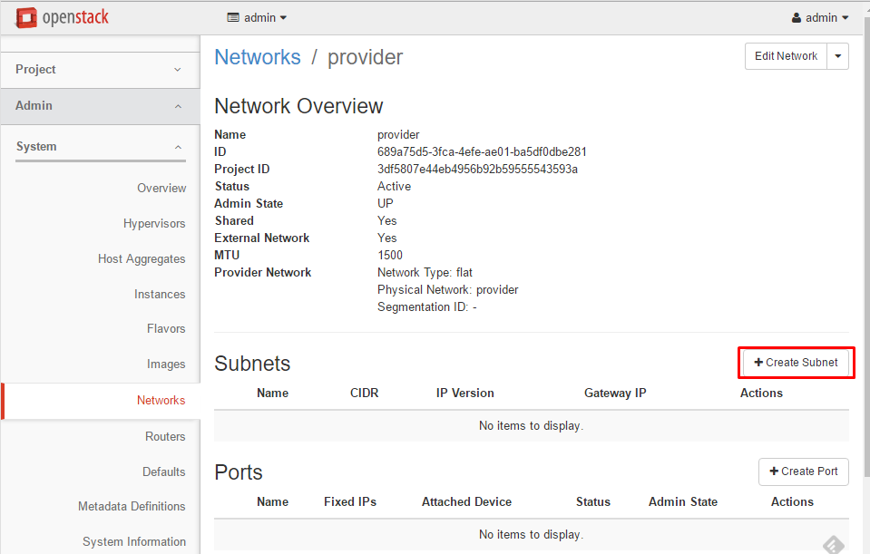
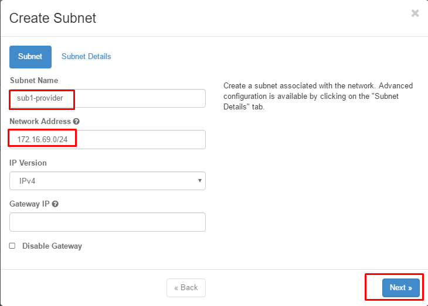
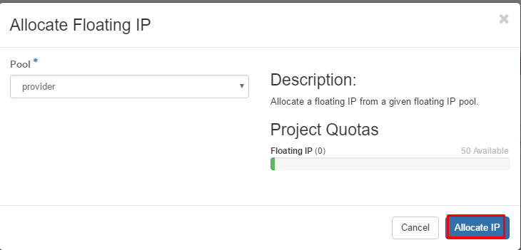
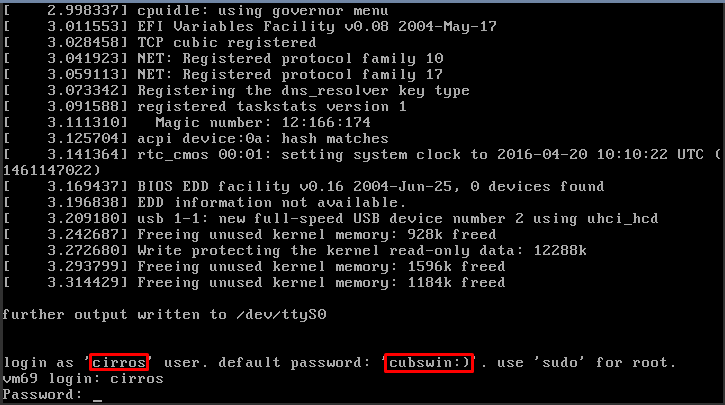

# Installation Steps

### Prepare LAB enviroment
- Using in VMware Workstation or Virtualbox ... enviroment

#### Configure CONTROLLER NODE
```sh
OS: Ubuntu Server 14.04 64 bit
RAM: 4GB
CPU: 2x2,  VT supported
NIC1: eth0: 10.10.10.0/24 (interntel range, using vmnet or hostonly in VMware Workstation)
NIC2: eth1: 172.16.69.0/24, gateway 172.16.69.1 (external range - using NAT or Bridge VMware Workstation)
HDD: +60GB
```


#### Configure COMPUTE NODE
```sh
OS: Ubuntu Server 14.04 64 bit
RAM: 4GB
CPU: 2x2, VT supported
NIC1: eth0: 10.10.10.0/24 (interntel range, using vmnet or hostonly in VMware Workstation)
NIC2: eth1: 172.16.69.0/24, gateway 172.16.69.1 (external range - using NAT or Bridge VMware Workstation  )
HDD: +100GB
```

## Mô hình 2 node 


### Execute script
- Install git package and dowload script 
```sh
su -
apt-get update
apt-get -y install git 

git clone https://github.com/congto/OpenStack-Mitaka-Scripts.git
mv /root/OpenStack-Mitaka-Scripts/OPS-Mitaka-OVS-Ubuntu/scripts/ /root/
rm -rf OpenStack-Mitaka-Scripts/
cd scripts/
chmod +x *.sh
```

## Install on CONTROLLER NODE
### install IP establishment script and repos for mitaka
- Edit file `config.cfg` in dicrectory with IP that you want to use.
 
```sh
bash ctl-1-ipadd.sh
```

### Install NTP, MariaDB packages
```sh
bash ctl-2-prepare.sh
```

### Install KEYSTONE
- Install Keystone
```sh
bash ctl-3.keystone.sh
```

- Declare enviroment parameter
```sh
source admin-openrc
```

### Install GLANCE
```sh
bash ctl-4-glance.sh
```

### Install NOVA
```sh
bash ctl-5-nova.sh
```

### Install Cinder
- Lưu ý: chỉ chọn một trong 2 lựa chọn dưới đây
- `Lựa chọn 1`: Không tách node cinder thành một máy chủ riêng:
 - Nếu cài `cinder-volume` cùng node compute thì thực hiện sau sau, lưu ý máy controller cần có ổ cứng `/dev/vdb`.
 
      ```sh
      ctl-7-cinder-aio.sh
      ```
- `Lựa chọn 2`: Tách node cinder ra một máy chủ riêng
 - Với mô hình tách node cinder (cài thành phần `cinder-volume`) thì thực hiện script.
 
      ```sh
      ctl-7-cinder.sh
      ```
 - Lúc này cần thực hiện các bước tiếp theo trên máy chủ `Cinder`


### Install NEUTRON
```sh
bash ctl-6-neutron.sh
```
- After NEUTRON installation done, controller node will restart.
- Login with `root` end execute Horizon installation script.

### Install HORIZON
- Login with  `root` privilege and execute script below
```sh
bash ctl-horizon.sh
```

## Install on COMPUTE NODE
### Dowload GIT and script
- install git package and dowload script 
```sh
su -
apt-get update
apt-get -y install git 

git clone https://github.com/congto/OpenStack-Mitaka-Scripts.git
mv /root/OpenStack-Mitaka-Scripts/OPS-Mitaka-OVS-Ubuntu/scripts/ /root/
rm -rf OpenStack-Mitaka-Scripts/
cd scripts/
chmod +x *.sh
```

### Establish IP and hostname
- Edit file `config.cfg`  to make it suitable with your IP.
- Execute script to establish IP, hostname
```sh
bash com1-1-ipdd.sh
```
- The server will restart after script `com1-ipdd.sh` is executed.
- Login to server with root privilege and execute conponents installation script on Nova

```sh
su -
cd scripts/
com1-2-ovs.sh
```

After install COMPUTE NODE, move to step that guide to use dashboard


## Using dashboard to initialize network, VM, rules.

- Login to dasboard


- Select tab `admin => Access & Security => Manage Rules`


- Select tab `Add Rule`


- Open all rule from outside to virtual machine



### Initialize network
#### Initialize external network range
- Select tab `Admin => Networks => Create Network`


- Enter and select tabs like picture below.

```sh
Name: provider
Project: admin
Provider Network Typy: Flat
Physical Network: provider
Admin State: UP
Shared: check
External Network: check
```

- Click to newly created `provider` to declare subnet for external range.


- Select tab `Creat Subnet`


- Declare IP range of subnet for external range


- Declare pools and DNS


#### Initialize internal network range
- Select tabs in turn of rank : "admin => Project => Network => Networks => Create Network"


- Declare name for internal network


- Declare subnet for internal network


- Declare IP range for Internal network


#### Initialize Router for project admin
- Select by tabs "admin => Project => Network => Routers => Create Router"


- Initialize router name and select like picture below


- Apply interface for router


- ending of initializing steps:  exteral network, internal network, router


## Initialize virtual machine (Instance)
- Project admin => Instances => Launch Instance"





## Check virtual machine (Instance)





- Nhập mật khẩu với thông tin dưới
```sh
user: cirros
password: cubsin:)
```


